# Лабораторно-практична робота №8-9: Full-stack інтеграція (Frontend)

## Тема
Full-stack інтеграція: розробка UI на базі професійного бойлерплейту.

## Мета роботи
Пройти повний, реалістичний цикл розробки: від проєктування інтерфейсу до його інтеграції з REST API, використовуючи професійний набір інструментів. Навчитись керувати серверним станом за допомогою TanStack Query, будувати надійні форми з React Hook Form та Zod, та організовувати навігацію за допомогою TanStack Router.

## Короткий опис реалізованого функціоналу
У межах роботи було розроблено повноцінний клієнтський додаток. Весь описаний нижче функціонал (API-запити, маршрутизація, форми, валідація, таблиці відображення, сторінка логіну) реалізовано для всіх 12 сутностей бази даних.

Для детальної демонстрації архітектури та коду в цьому звіті наведені приклади для сутності ParkingSpace.

## Ключові можливості:

- **Архітектура:** - Використання Feature-Based підходу (папки features/parkingspaces, features/parkingzones тощо).
- **API Клієнт:** - Налаштований Axios із перехоплювачами (interceptors) для автоматичного додавання JWT-токена зі сховища Zustand та обробки 401 помилки (автоматичний логаут).
- **Керування даними:** - TanStack Query забезпечує кешування, фонове оновлення та інвалідацію запитів після мутацій (створення/редагування/видалення).
- **Навігація:** - Типізована маршрутизація через TanStack Router (приклад: /parkingspaces, /parkingspaces/edit/$ps_id).
- **Форми:** - Реалізовано 4 типи сторінок для кожної з 12 сутностей (Create, Edit, Show, List). Використано React Hook Form у зв'язці із Zod для суворої валідації типів даних.
- **Повноцінна система Авторизації (JWT):** - Реєстрація, Логін, збереження сесії (Persist), автоматичний вихід при закінченні терміну дії токена.
- **Покращений UX/UI:** - Реалізовано бокову навігаційну панель (Sidebar) для зручної орієнтації між 12-ма таблицями, замість стандартного хедера.
- **Додаткові сторінки:** - Створено інформаційні сторінки для візуальної повноти додатку.

## Приклади ключового коду
1. Конфігурація Axios (API-клієнт)
Налаштування клієнта з інтеграцією authStore для передачі токена та обробки авторизації.

```ts
import axios from 'axios';
import { useAuthStore } from '@/store/authStore';

const apiClient = axios.create({
  baseURL: import.meta.env['VITE_API_BASE_URL'], 
  headers: {
    'Content-Type': 'application/json',
  },
});

apiClient.interceptors.request.use(
  (config) => {
    const token = useAuthStore.getState().token;
    if (token) {
      config.headers.Authorization = `Bearer ${token}`;
    }
    return config;
  },
  (error) => Promise.reject(error)
);

apiClient.interceptors.response.use(
  (response) => response,
  (error) => {
    if (error.response?.status === 401) {
      useAuthStore.getState().logout();
      window.location.href = '/login';
    }
    return Promise.reject(error);
  }
);

export default apiClient;
```

2. Сервісний шар та Хуки (TanStack Query)
Інкапсуляція API-запитів та React-хуків для сутності ParkingSpace. Реалізовано автоматичне оновлення списку (invalidateQueries) після змін.

```ts
// src/features/parkingspaces/api.ts
import { useQuery, useMutation, useQueryClient } from '@tanstack/react-query';
import { useNavigate } from '@tanstack/react-router';
import apiClient from '../../lib/axios';
import { ParkingSpace } from './types';

const getParkingSpaces = async (): Promise<ParkingSpace[]> => {
  const response = await apiClient.get('/parkingspaces');
  
  return response.data.data; 
};

const getParkingSpaceById = async (id: number): Promise<ParkingSpace> => {
  const response = await apiClient.get(`/parkingspaces/${id}`);
  return response.data.data;
};

const createParkingSpace = async (data: Omit<ParkingSpace, 'ps_id'>): Promise<ParkingSpace> => {
  const response = await apiClient.post('/parkingspaces', data);
  return response.data.data;
};

const updateParkingSpace = async ({
  id,
  data,
}: {
  id: number;
  data: Partial<Omit<ParkingSpace, 'ps_id'>>;
}): Promise<ParkingSpace> => {
  const response = await apiClient.put(`/parkingspaces/${id}`, data);
  return response.data.data;
};

const deleteParkingSpace = async (id: number): Promise<void> => {
  await apiClient.delete(`/parkingspaces/${id}`);
};

export const useParkingSpaces = () => useQuery<ParkingSpace[]>({
  queryKey: ['parkingspaces'],
  queryFn: getParkingSpaces,
});

export const useParkingSpace = (id: number) => useQuery<ParkingSpace>({
  queryKey: ['parkingspaces', id],
  queryFn: () => getParkingSpaceById(id),
});

export const useCreateParkingSpace = () => {
  const queryClient = useQueryClient();
  const navigate = useNavigate();

  return useMutation({
    mutationFn: createParkingSpace,
    onSuccess: () => {
      queryClient.invalidateQueries({ queryKey: ['parkingspaces'] });
      navigate({ to: '/parkingspaces/' as any });
    },
  });
};

export const useUpdateParkingSpace = () => {
  const queryClient = useQueryClient();
  const navigate = useNavigate();

  return useMutation({
    mutationFn: updateParkingSpace,
    onSuccess: (updated) => {
      queryClient.invalidateQueries({ queryKey: ['parkingspaces'] });
      queryClient.setQueryData(['parkingspaces', updated.ps_id], updated);
      navigate({ to: '/parkingspaces/' as any });
    },
  });
};

export const useDeleteParkingSpace = () => {
  const queryClient = useQueryClient();

  return useMutation({
    mutationFn: deleteParkingSpace,
    onSuccess: () => {
      queryClient.invalidateQueries({ queryKey: ['parkingspaces'] });
    },
  });
};
```

3. Валідація та Типізація (Zod & Types)
Схема валідації використовує z.coerce, щоб коректно обробляти числові поля, які приходять з HTML-форм як рядки.
```ts
src\features\parkingspaces\schema.ts
import { z } from "zod";

export const parkingSpaceSchema = z.object({
  ps_number: z.string().min(1, "Номер місця не може бути порожнім"),

  ps_level: z.coerce
    .number()
    .int("Рівень має бути цілим числом")
    .min(0, "Рівень не може бути від'ємним"),

  ps_status: z.enum(["вільне", "зайняте", "зарезервоване"], {
    message: "Оберіть статус",
  }),

  ps_auto_type: z.enum(["Легкове", "Вантажне", "Електрокар"], {
    message: "Оберіть тип авто",
  }),

  pz_id: z.coerce
    .number()
    .int("ID має бути цілим числом")
    .positive("Оберіть зону зі списку"),
});

export type ParkingSpaceFormValues = z.infer<typeof parkingSpaceSchema>;
```

```ts
// src/features/parkingspaces/types.ts
import { ParkingZone } from '../parkingzones/types';

export interface ParkingSpace {
  ps_id: number;
  ps_number: string;
  ps_level: number;
  ps_status: string;
  ps_auto_type: string;
  pz_id: number;
  parkingZone?: ParkingZone; 
}
```

4. Розглянемо для прикладу реалізацію сторінки редагування:
- Сторінка ParkingSpaceEditPage демонструє:
- Отримання ID з URL через useParams.
- Завантаження даних місця та списку зон (для select-а) паралельно.
- Передзаповнення форми через useEffect та reset.
- Обробку помилок сервера через handleServerErrors.

```
// src/features/parkingspaces/pages/ParkingSpaceEditPage.tsx
import { useParams, useNavigate } from "@tanstack/react-router";
import { useParkingSpace, useUpdateParkingSpace } from "../api";
import { useForm } from "react-hook-form";
import { zodResolver } from "@hookform/resolvers/zod";
import { useEffect } from "react"; 
import { handleServerErrors } from "../../../components/utils/formErrors";
import { useParkingZones } from "../../parkingzones/api"; 
import { parkingSpaceSchema, ParkingSpaceFormValues } from "../schema";

export const ParkingSpaceEditPage = () => {
  const { ps_id } = useParams({ from: "/parkingspaces/edit/$ps_id" });
  const navigate = useNavigate();
  const spaceId = Number(ps_id);

  const { data: space, isLoading, isError } = useParkingSpace(spaceId);
  const { data: zones, isLoading: isZonesLoading } = useParkingZones();

  const updateMutation = useUpdateParkingSpace();
  
  const {
    register,
    handleSubmit,
    formState: { errors },
    setError,
    clearErrors,
    reset,
  } = useForm<ParkingSpaceFormValues>({
    resolver: zodResolver(parkingSpaceSchema) as any,
  });

  useEffect(() => {
    if (space) {
      reset({
        ps_number: space.ps_number,
        ps_level: space.ps_level,
        ps_status: space.ps_status as any, 
        ps_auto_type: space.ps_auto_type as any,
        pz_id: space.pz_id,
      });
    }
  }, [space, reset]);
 
  const onSubmit = (data: ParkingSpaceFormValues) => {
    clearErrors(); 

    updateMutation.mutate(
      {
        id: spaceId,
        data: data,
      },
      {
        onSuccess: () => {
          alert("Паркувальне місце оновлено успішно!");
          navigate({ to: "/parkingspaces" });
        },
        onError: (error) => {
          const generalError = handleServerErrors(error, setError);
          if (generalError) {
             alert(generalError);
          }
        },
      }
    );
  };

  if (isLoading) return <div className="h-full flex items-center justify-center text-gray-500">Завантаження...</div>;
  if (isError || !space) return <div className="h-full flex items-center justify-center text-red-500">Помилка: місце не знайдено.</div>;

  return (
    <div className="h-full w-full flex flex-col items-center justify-center p-6">
      <h2 className="text-2xl font-bold text-gray-800 mb-6">
        Редагування місця: {space.ps_number}
      </h2>

      <form
        onSubmit={handleSubmit(onSubmit)} 
        className="bg-white shadow-xl rounded-2xl border border-gray-100 p-8 w-full max-w-2xl space-y-5"
      >
        {/* Рядок 1: Номер місця */}
        <div>
          <label className="block text-gray-700 font-medium mb-1 text-sm">Номер місця</label>
          <input
            type="text"
            {...register("ps_number")} 
            className={`border rounded-lg p-2.5 w-full focus:ring-2 focus:ring-green-100 outline-none transition ${errors.ps_number ? 'border-red-500' : 'border-gray-300'}`}
            placeholder="Введіть номер місця"
          />
          {errors.ps_number && (
            <p className="text-red-600 text-xs mt-1">{errors.ps_number.message}</p>
          )}
        </div>

        {/* Рядок 2: Рівень та Статус */}
        <div className="grid grid-cols-1 md:grid-cols-2 gap-4">
            <div>
              <label className="block text-gray-700 font-medium mb-1 text-sm">Рівень</label>
              <input
                type="number"
                {...register("ps_level")}
                className={`border rounded-lg p-2.5 w-full focus:ring-2 focus:ring-green-100 outline-none transition ${errors.ps_level ? 'border-red-500' : 'border-gray-300'}`}
                placeholder="Введіть рівень"
              />
              {errors.ps_level && (
                <p className="text-red-600 text-xs mt-1">{errors.ps_level.message}</p>
              )}
            </div>

            <div>
              <label className="block text-gray-700 font-medium mb-1 text-sm">Статус</label>
              <select
                {...register("ps_status")}
                className={`border rounded-lg p-2.5 w-full focus:ring-2 focus:ring-green-100 outline-none transition ${errors.ps_status ? 'border-red-500' : 'border-gray-300'}`}
              >
                <option value="">Оберіть статус</option>
                <option value="вільне">Вільне</option>
                <option value="зайняте">Зайняте</option>
                <option value="зарезервоване">Зарезервоване</option>
              </select>
              {errors.ps_status && (
                <p className="text-red-600 text-xs mt-1">{errors.ps_status.message}</p>
              )}
            </div>
        </div>

        {/* Рядок 3: Тип та Зона */}
        <div className="grid grid-cols-1 md:grid-cols-2 gap-4">
            <div>
              <label className="block text-gray-700 font-medium mb-1 text-sm">Тип авто</label>
              <select
                {...register("ps_auto_type")}
                className={`border rounded-lg p-2.5 w-full focus:ring-2 focus:ring-green-100 outline-none transition ${errors.ps_auto_type ? 'border-red-500' : 'border-gray-300'}`}
              >
                <option value="">Оберіть тип авто</option>
                <option value="Легкове">Легкове</option>
                <option value="Вантажне">Вантажне</option>
                <option value="Електрокар">Електрокар</option>
              </select>
              {errors.ps_auto_type && (
                <p className="text-red-600 text-xs mt-1">{errors.ps_auto_type.message}</p>
              )}
            </div>

            <div>
              <label className="block text-gray-700 font-medium mb-1 text-sm">Паркінг-зона</label>
              <select
                {...register("pz_id")}
                className={`border rounded-lg p-2.5 w-full focus:ring-2 focus:ring-green-100 outline-none transition ${errors.pz_id ? 'border-red-500' : 'border-gray-300'}`}
                disabled={isZonesLoading}
              >
                <option value="">Оберіть зону</option>
                {isZonesLoading && <option disabled>Завантаження зон...</option>}
                {zones?.map((zone: any) => (
                  <option key={zone.pz_id} value={zone.pz_id}>
                    {zone.pz_name}
                  </option>
                ))}
              </select>
              {errors.pz_id && (
                <p className="text-red-600 text-xs mt-1">{errors.pz_id.message}</p>
              )}
            </div>
        </div>

        <button
          type="submit"
          disabled={updateMutation.isPending}
          className="bg-green-600 text-white px-4 py-3 rounded-xl hover:bg-green-700 transition w-full disabled:bg-gray-400 font-medium shadow-sm hover:shadow-md mt-4"
        >
          {updateMutation.isPending ? "Оновлення..." : "Зберегти зміни"}
        </button>
      </form>

      <button
        onClick={() => navigate({ to: "/parkingspaces" })}
        className="mt-6 text-gray-500 hover:text-blue-600 transition text-sm font-medium"
      >
        ← Скасувати та повернутися
      </button>
    </div>
  );
};
```

5. Маршрутизація (TanStack Router)
Приклади визначення маршрутів для списку та редагування.

```
src\routes\parkingspaces\index.tsx
import { createFileRoute } from '@tanstack/react-router';
import { ParkingSpacesPage } from '@/features/parkingspaces/pages/ParkingSpacesPage';

export const Route = createFileRoute('/parkingspaces/')({
  component: ParkingSpacesPage,
});
```

```
src\routes\parkingspaces\edit\$ps_id.tsx
import { createFileRoute } from "@tanstack/react-router";
import { ParkingSpaceEditPage } from "@/features/parkingspaces/pages/ParkingSpaceEditPage";

export const Route = createFileRoute("/parkingspaces/edit/$ps_id")({
  component: ParkingSpaceEditPage,
});
```

6. Керування станом авторизації (Zustand + Persist)
Використано Zustand для глобального зберігання стану користувача та токена. Middleware persist автоматично зберігає сесію у LocalStorage, щоб користувач не "вилітав" після оновлення сторінки.

```ts
src\store\authStore.ts
import { create } from 'zustand';
import { persist } from 'zustand/middleware';
import { User } from '@/features/auth/types';

interface AuthState {
  token: string | null;
  user: User | null;
  isAuthenticated: boolean;
  login: (token: string, user: User) => void;
  setToken: (token: string) => void;
  logout: () => void;
}

export const useAuthStore = create<AuthState>()(
  persist(
    (set) => ({
      token: null,
      user: null,
      isAuthenticated: false,
      login: (token, user) => set({ token, user, isAuthenticated: true }),
      
      setToken: (token) => set({ token, isAuthenticated: true }),

      logout: () => set({ token: null, user: null, isAuthenticated: false }),
    }),
    {
      name: 'auth-storage',
    }
  )
);
```

7. Логіка Логіну та Декодування JWT
Хук useLogin не просто відправляє дані, а й вручну декодує JWT-токен на клієнті (функція parseJwt), щоб миттєво отримати роль користувача та виконати правильний редірект (Адміна - на таблиці, юзера - на головну).

```ts
src\features\auth\api.ts
import { useMutation } from '@tanstack/react-query';
import apiClient from '@/lib/axios';
import { useAuthStore } from '@/store/authStore';
import { useNavigate } from '@tanstack/react-router';
import { LoginCredentials, UserRole } from './types';
import { RegisterCredentials } from './types';
import { z } from 'zod'; 

interface DecodedToken {
  id: number;
  email: string;
  username: string;
  name: string;
  role: UserRole;
  exp?: number;
}

export const loginSchema = z.object({
  email: z.string().email("Некоректний email"),
  password: z.string().min(1, "Введіть пароль"),
});

function parseJwt(token: string): DecodedToken | null {
  try {
    if (!token) return null;

    const parts = token.split('.');
    if (parts.length < 2) return null;
    
    const base64Url = parts[1];
    if (!base64Url) return null;

    const base64 = base64Url.replace(/-/g, '+').replace(/_/g, '/');
    const jsonPayload = decodeURIComponent(window.atob(base64).split('').map(function(c) {
        return '%' + ('00' + c.charCodeAt(0).toString(16)).slice(-2);
    }).join(''));

    return JSON.parse(jsonPayload) as DecodedToken;
  } catch (e) {
    console.error("Помилка розшифровки токена", e);
    return null;
  }
}

export const useLogin = () => {
  const login = useAuthStore((state) => state.login);
  const navigate = useNavigate();

  return useMutation({
    mutationFn: async (credentials: LoginCredentials) => {
      const response = await apiClient.post('/auth/login', credentials);
      return response.data; 
    },
    onSuccess: (responseBody: any) => {
      console.log('Server raw response:', responseBody);

      let token = '';

      if (responseBody.data && typeof responseBody.data === 'string') {
        token = responseBody.data;
      }
      else if (typeof responseBody === 'string') {
        token = responseBody;
      }
      else if (responseBody.data?.token || responseBody.data?.accessToken) {
        token = responseBody.data.token || responseBody.data.accessToken;
      }
      else if (responseBody.token || responseBody.accessToken) {
        token = responseBody.token || responseBody.accessToken;
      }

      if (token) {
        token = token.replace('Bearer ', '').trim();
      }

      if (!token) {
        alert("Помилка: Не вдалося знайти токен.");
        return;
      }

      const decodedUser = parseJwt(token);

      const user = {
        id: decodedUser?.id || 0,
        email: decodedUser?.email || '',
        username: decodedUser?.username || '',
        name: decodedUser?.name || '',
        role: decodedUser?.role || 'STANDARD', 
      };

      login(token, user as any);

      if (user.role === 'ADMINISTRATOR') {
        navigate({ to: '/parkingspaces/' as any }); 
      } else {
        navigate({ to: '/' as any });
      }
    },
    onError: (error: any) => {
      console.error('Login failed:', error);
      alert('Невірний логін або пароль');
    }
  });
};

export const useRegister = () => {
  const navigate = useNavigate();

  return useMutation({
    mutationFn: async (data: RegisterCredentials) => {
      const response = await apiClient.post('/auth/register', data);
      return response.data;
    },
    onSuccess: () => {
      alert("Акаунт успішно створено! Тепер увійдіть.");
      navigate({ to: '/login' as any });
    },
    onError: (error: any) => {
      console.error('Registration failed:', error);
      alert(error.response?.data?.message || 'Помилка реєстрації. Можливо, такий email вже зайнятий.');
    }
  });
};
```

8. Реалізація сторінки входу (UI та Логіка)
Сторінка LoginPage містить форму, стилізацію та обробку подій. Маршрут (Route) винесено в окремий файл для чистоти архітектури.
```
// src/features/pages/LoginPage.tsx
import { Link } from '@tanstack/react-router'; 
import { useForm } from 'react-hook-form';
import { zodResolver } from '@hookform/resolvers/zod';
import { z } from 'zod';
import { useLogin } from '@/features/auth/api';

const loginSchema = z.object({
  email: z.string().email(),
  password: z.string().min(1),
});

export function LoginPage() {
  const { mutate: login, isPending, error } = useLogin();
  const { register, handleSubmit } = useForm({
    resolver: zodResolver(loginSchema),
  });

  return (
    <div className="flex w-full h-full items-center justify-center bg-white overflow-hidden p-6">
      <div className="flex flex-col items-center">
        <form 
          onSubmit={handleSubmit((data: any) => login(data))} 
          // Зменшено shadow-2xl до shadow-xl та прибрано border
          className="w-full max-w-md p-10 bg-white rounded-3xl shadow-xl"
        >
          {/* Заголовок */}
          <h2 className="text-3xl mb-10 font-bold text-center text-gray-800">
            <span className="text-indigo-600">Park</span>
            <span className="text-blue-500">Go</span> Вхід
          </h2>
          
          {error && (
            <div className="mb-4 flex items-center p-3 text-red-700 bg-red-100 rounded-lg border border-red-200">
              <svg className="w-5 h-5 mr-3 flex-shrink-0" fill="currentColor" viewBox="0 0 20 20"><path fillRule="evenodd" d="M18 10a8 8 0 11-16 0 8 8 0 0116 0zm-7 4a1 1 0 11-2 0 1 1 0 012 0zm-1-9a1 1 0 00-1 1v4a1 1 0 102 0V6a1 1 0 00-1-1z" clipRule="evenodd"></path></svg>
              <span className="text-sm font-medium">Помилка входу. Перевір дані.</span>
            </div>
          )}

          <div className="mb-5">
            <label className="block text-base font-medium text-gray-700 mb-1" htmlFor="email">Email</label>
            <input 
              id="email"
              {...register('email')} 
              className="w-full border-gray-300 border p-4 rounded-xl focus:ring-indigo-500 focus:border-indigo-500 shadow-sm transition duration-150 ease-in-out text-lg" 
              placeholder="введіть email"
              type="email"
            />
          </div>

          <div className="mb-6">
            <label className="block text-base font-medium text-gray-700 mb-1" htmlFor="password">Пароль</label>
            <input 
              id="password"
              type="password" 
              {...register('password')} 
              className="w-full border-gray-300 border p-4 rounded-xl focus:ring-indigo-500 focus:border-indigo-500 shadow-sm transition duration-150 ease-in-out text-lg" 
              placeholder="********"
            />
          </div>

          <button 
            type="submit" 
            disabled={isPending}
            className="w-full bg-violet-600 text-white py-4 rounded-xl hover:bg-violet-700 disabled:opacity-50 shadow-lg font-semibold transition duration-200 flex items-center justify-center text-lg"
          >
            {isPending ? (
              <svg className="animate-spin h-5 w-5 text-white" xmlns="http://www.w3.org/2000/svg" fill="none" viewBox="0 0 24 24">
                <circle className="opacity-25" cx="12" cy="12" r="10" stroke="currentColor" strokeWidth="4"></circle>
                <path className="opacity-75" fill="currentColor" d="M4 12a8 8 0 018-8V0C5.373 0 0 5.373 0 12h4zm2 5.291A7.962 7.962 0 014 12H0c0 3.042 1.135 5.824 3 7.938l3-2.647z"></path>
              </svg>
            ) : (
              'Увійти'
            )}
          </button>
        </form>
        
        {/* Посилання на Реєстрацію */}
        <Link 
          to="/register" 
          className="mt-6 text-base font-medium text-gray-600 hover:text-indigo-600 transition duration-150"
        >
          Немає акаунту? <span className="font-semibold underline">Зареєструватися</span>
        </Link>
      </div>
    </div>
  );
}
```
Файл маршруту (src\routes\login.tsx):
```
// src/routes/login.tsx
import { createFileRoute } from '@tanstack/react-router';
import { LoginPage } from '@/features/pages/LoginPage';

export const Route = createFileRoute('/login')({
  component: LoginPage,
});
```

9.Реалізація сторінки реєстраці
Аналогічно до логіну, логіка та UI винесені в окремий компонент RegisterPage, а файл маршруту залишається чистим.
```
src\features\pages\RegisterPage.tsx
// src/features/pages/RegisterPage.tsx
import { Link } from '@tanstack/react-router';
import { useForm } from 'react-hook-form';
import { zodResolver } from '@hookform/resolvers/zod';
import { z } from 'zod';
import { useRegister } from '@/features/auth/api';
import { RegisterCredentials } from '@/features/auth/types';

const registerSchema = z.object({
  email: z.string().email("Некоректний email"),
  username: z.string().min(3, "Мінімум 3 символи"),
  name: z.string().min(2, "Введіть повне ім'я"),
  password: z.string().min(6, "Пароль має бути мінімум 6 символів"),
  passwordConfirm: z.string().min(1, "Підтвердіть пароль"),
}).refine((data) => data.password === data.passwordConfirm, {
  message: "Паролі не співпадають",
  path: ["passwordConfirm"],
});

export function RegisterPage() {
  const { mutate: registerUser, isPending } = useRegister();
  
  const { register, handleSubmit, formState: { errors } } = useForm<RegisterCredentials>({
    resolver: zodResolver(registerSchema),
  });

  const onSubmit = (data: RegisterCredentials) => {
    registerUser(data);
  };

  return (
    <div className="flex w-full h-full items-center justify-center bg-white overflow-hidden p-4">
      <div className="flex flex-col items-center">
        <form 
          onSubmit={handleSubmit(onSubmit)} 
          className="w-full max-w-md p-6 bg-white rounded-3xl shadow-xl space-y-4"
        >
          {/* Заголовок */}
          <h2 className="text-2xl mb-6 font-bold text-center text-gray-800">
            <span className="text-indigo-600">Park</span>
            <span className="text-blue-500">Go</span> Реєстрація
          </h2>
          
          {/* Email */}
          <div>
            <label className="block text-sm font-medium text-gray-700 mb-1" htmlFor="email">Email</label>
            <input 
              id="email"
              {...register('email')} 
              autoComplete="email"
              className="w-full border-gray-300 border p-3 rounded-xl focus:ring-indigo-500 focus:border-indigo-500 shadow-sm transition duration-150 ease-in-out text-base" 
              placeholder="user@gmail.com" 
              type="email"
            />
            {errors.email && <p className="text-red-500 text-xs mt-1">{errors.email.message}</p>}
          </div>

          <div className="flex space-x-4">
            {/* Username */}
            <div className="w-1/2">
                <label className="block text-sm font-medium text-gray-700 mb-1" htmlFor="username">Username (Логін)</label>
                <input 
                    id="username"
                    {...register('username')} 
                    autoComplete="username" 
                    className="w-full border-gray-300 border p-3 rounded-xl focus:ring-indigo-500 focus:border-indigo-500 shadow-sm transition duration-150 ease-in-out text-base" 
                    placeholder="Edward" 
                />
                {errors.username && <p className="text-red-500 text-xs mt-1">{errors.username.message}</p>}
            </div>

            {/* Name */}
            <div className="w-1/2">
                <label className="block text-sm font-medium text-gray-700 mb-1" htmlFor="name">Повне ім'я</label>
                <input 
                    id="name"
                    {...register('name')} 
                    autoComplete="off"
                    className="w-full border-gray-300 border p-3 rounded-xl focus:ring-indigo-500 focus:border-indigo-500 shadow-sm transition duration-150 ease-in-out text-base" 
                    placeholder="Edward Cullen" 
                />
                {errors.name && <p className="text-red-500 text-xs mt-1">{errors.name.message}</p>}
            </div>
          </div>

          {/* Паролі */}
          <div className="flex space-x-4">
            {/* Password */}
            <div className="w-1/2">
              <label className="block text-sm font-medium text-gray-700 mb-1" htmlFor="password">Пароль</label>
              <input 
                id="password"
                type="password" 
                {...register('password')} 
                autoComplete="new-password"
                className="w-full border-gray-300 border p-3 rounded-xl focus:ring-indigo-500 focus:border-indigo-500 shadow-sm transition duration-150 ease-in-out text-base" 
                placeholder="********"
              />
              {errors.password && <p className="text-red-500 text-xs mt-1">{errors.password.message}</p>}
            </div>

            {/* Password Confirm */}
            <div className="w-1/2">
              <label className="block text-sm font-medium text-gray-700 mb-1" htmlFor="passwordConfirm">Підтвердження</label>
              <input 
                id="passwordConfirm"
                type="password" 
                {...register('passwordConfirm')} 
                autoComplete="off" 
                className="w-full border-gray-300 border p-3 rounded-xl focus:ring-indigo-500 focus:border-indigo-500 shadow-sm transition duration-150 ease-in-out text-base" 
                placeholder="********"
              />
              {errors.passwordConfirm && <p className="text-red-500 text-xs mt-1">{errors.passwordConfirm.message}</p>}
            </div>
          </div>
          
          <button 
            type="submit" 
            disabled={isPending}
            className="w-full bg-violet-600 text-white py-3 rounded-xl hover:bg-violet-700 disabled:opacity-50 shadow-lg font-semibold transition duration-200 flex items-center justify-center text-base mt-4"
          >
            {isPending ? (
              <svg className="animate-spin h-4 w-4 text-white" xmlns="http://www.w3.org/2000/svg" fill="none" viewBox="0 0 24 24">
                <circle className="opacity-25" cx="12" cy="12" r="10" stroke="currentColor" strokeWidth="4"></circle>
                <path className="opacity-75" fill="currentColor" d="M4 12a8 8 0 018-8V0C5.373 0 0 5.373 0 12h4zm2 5.291A7.962 7.962 0 014 12H0c0 3.042 1.135 5.824 3 7.938l3-2.647z"></path>
              </svg>
            ) : (
              'Створити акаунт'
            )}
          </button>
        </form>

        {/* Посилання на Вхід */}
        <Link 
          to="/login" 
          className="mt-4 text-sm font-medium text-gray-600 hover:text-indigo-600 transition duration-150"
        >
          Вже є акаунт? <span className="font-semibold underline">Увійти</span>
        </Link>
      </div>
    </div>
  );
}
```

Файл маршруту (src\routes\register.tsx):

```
// src/routes/register.tsx
import { createFileRoute } from '@tanstack/react-router';
import { RegisterPage } from '@/features/pages/RegisterPage';

export const Route = createFileRoute('/register')({
  component: RegisterPage,
});
```

## Скріншоти роботи:
### 1. Сторінка Входу (Login)
Форма логіну. Після успіху токен зберігається в LocalStorage.

<p align="center"> 
  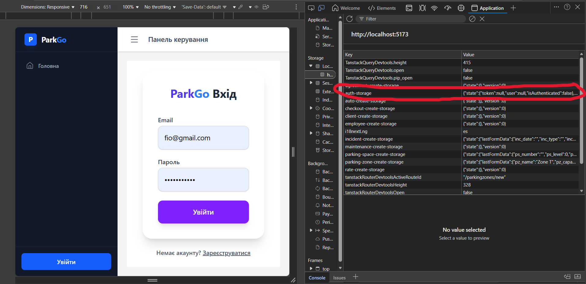 
</p>

<p align="center"> 
  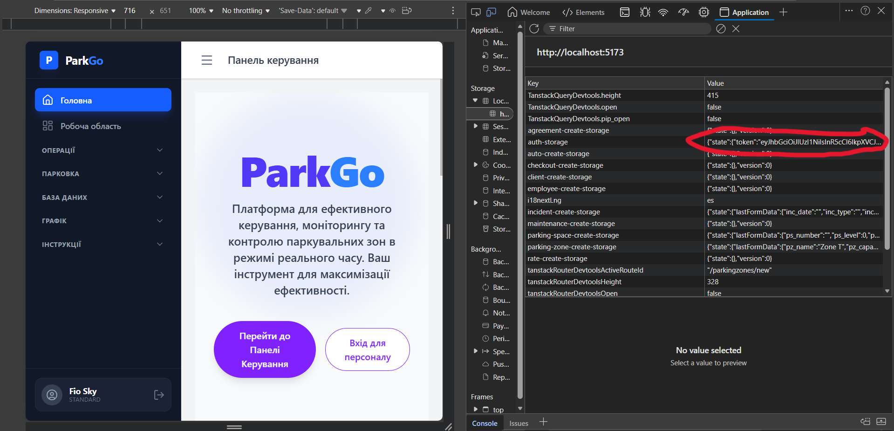 
</p>

### 2. Сторінка Реєстрації (Register)
Форма створення акаунту з перевіркою збігу паролів та унікальності пошти.

<p align="center"> 
  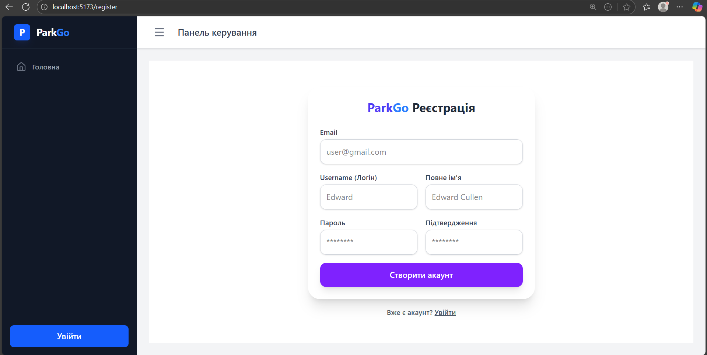 
</p>

### 3. Сайдбар та Навігація. Головна сторінка і доп. сторінки. 
Демонстрація бокового меню, яке дозволяє зручно перемикатися між 12-ма таблицями (ParkingSpaces, ParkingZones, Users тощо).

<p align="center"> 
   
</p>

<p align="center"> 
  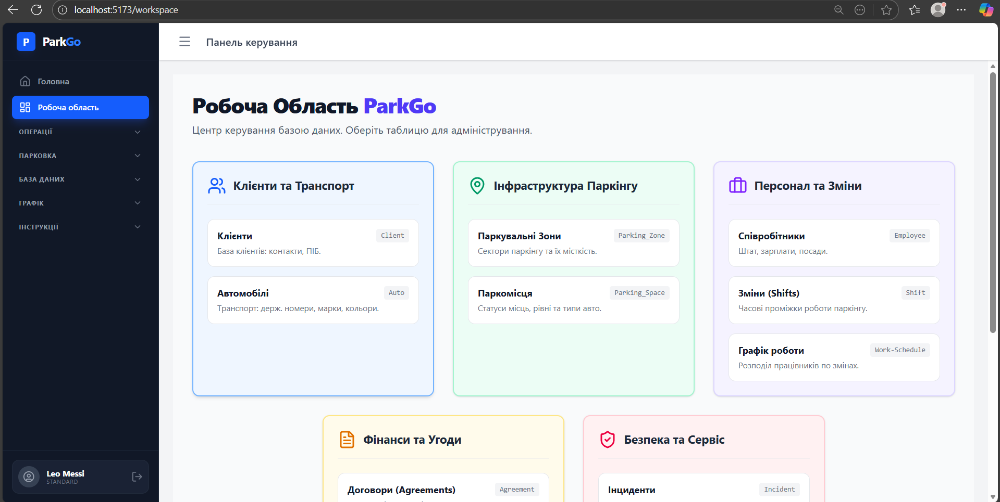 
</p>

<p align="center"> 
  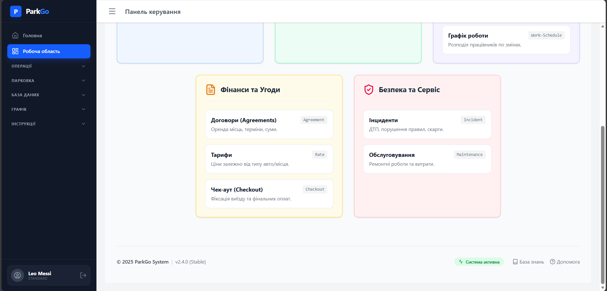 
</p>

<p align="center"> 
  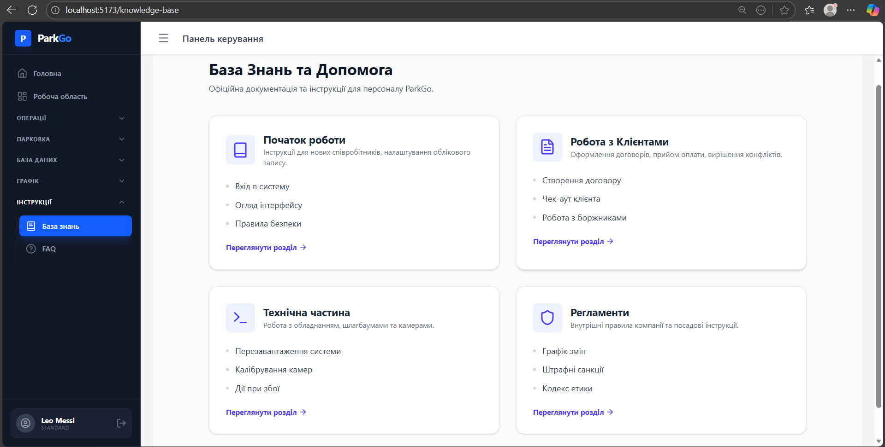 
</p>

<p align="center"> 
  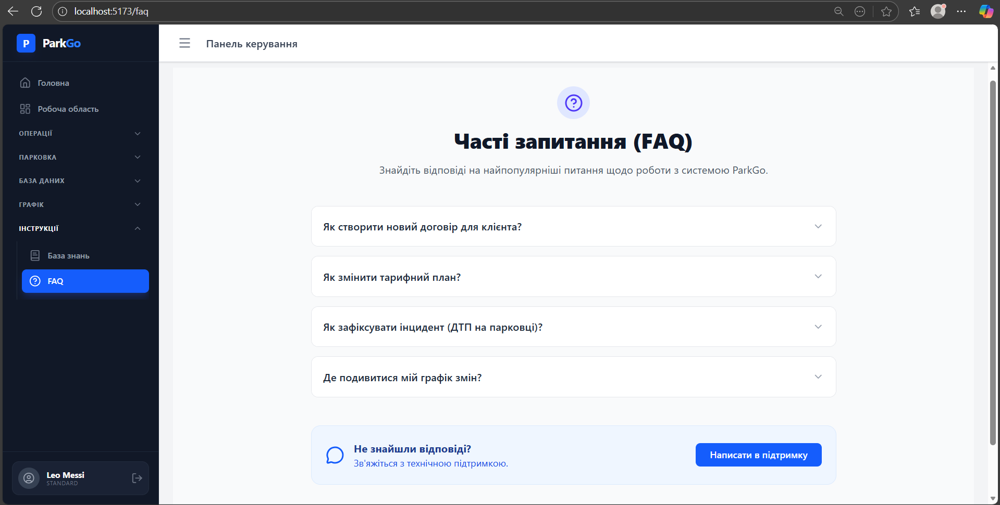 
</p>

### 1. Сторінка списку всіх паркомісць (ParkingSpace)
Відображає таблицю з даними, отриманими через GET-запит. 

<p align="center"> 
  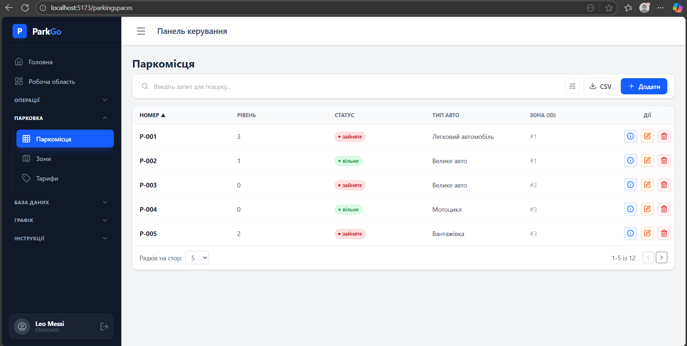 
</p>

<p align="center"> 
  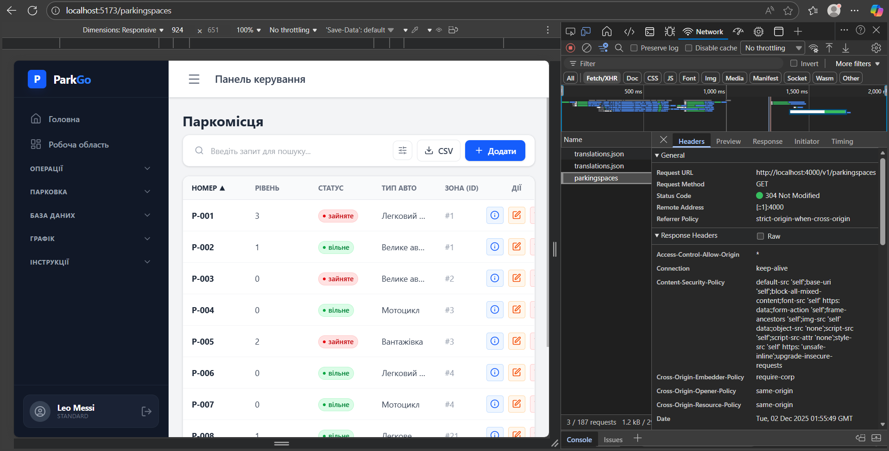 
</p>

### 2. Сторінка детальна інформація  (Show Page)
Форма показу інформації про договір.

<p align="center"> 
  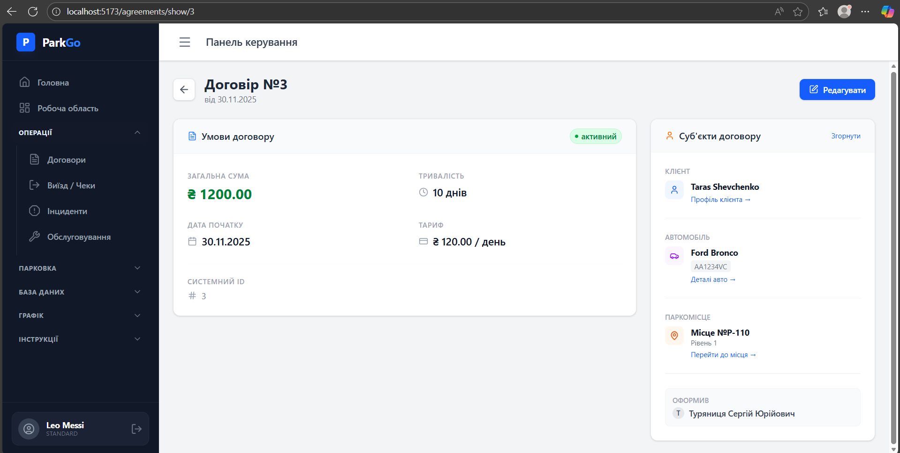 
</p>

### 3. Сторінка редагування (Autos)
Форма редагування сутності

<p align="center"> 
  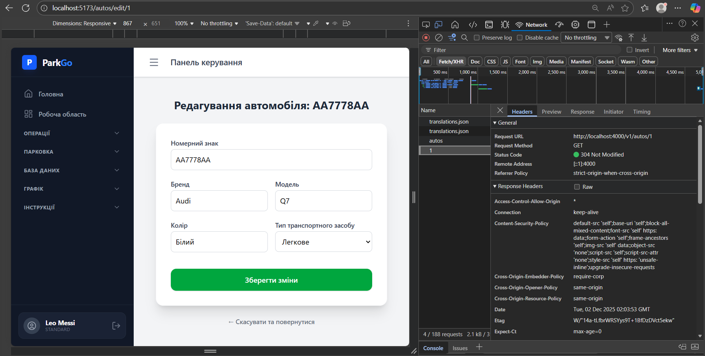 
</p>

### 4. Валідація форми (Zod)
Демонстрація помилок при введенні некоректних даних.

<p align="center"> 
  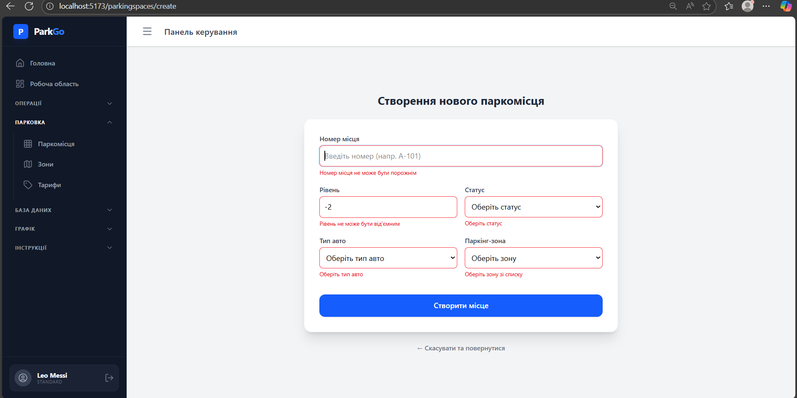 
</p>

### 5. Вкладка Network (DevTools)
Підтвердження реального запиту PUT при збереженні змін. 

<p align="center"> 
  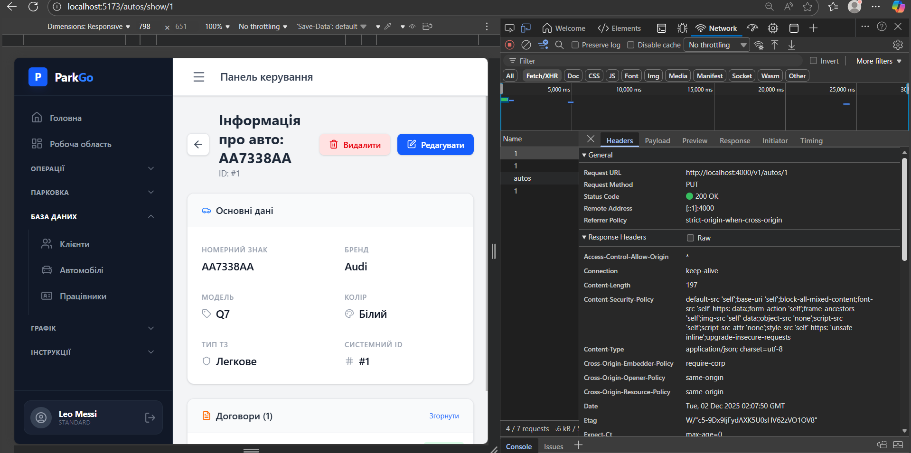 
</p>

<p align="center"> 
  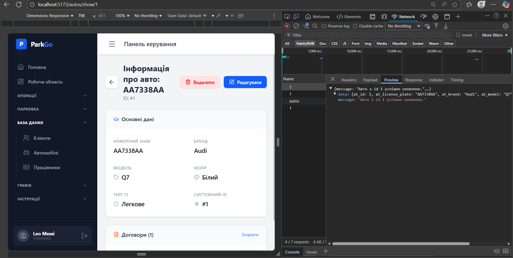 
</p>

### Коментарі щодо особливостей реалізації
1. У ході виконання роботи розроблено повноцінний клієнтський додаток (Frontend) для взаємодії з REST API.
2. Масштабованість: Реалізовано повний UI/UX для всіх 12 сутностей бази даних за єдиним архітектурним шаблоном (API → Schema → Pages).
3. Авторизація: Впроваджено систему входу на базі JWT.
4. Надійність: Забезпечено сувору типізацію та валідацію даних завдяки інтеграції Zod (з автоматичною конвертацією типів) та TanStack Router.
5. UX та Безпека: Налаштовано глобальну обробку помилок через інтерцептори Axios та автоматичне керування сесією користувача (автоматичний логаут при 401).

У ході виконання лабораторної роботи було успішно розроблено та інтегровано повноцінний клієнтський додаток (Frontend) для взаємодії з REST API курсового проєкту. Використання сучасного стеку технологій (React, TypeScript, TanStack Query/Router, Zod) дозволило створити гнучку та масштабовану архітектуру, яка повністю покриває функціонал для всіх 12 сутностей бази даних.
